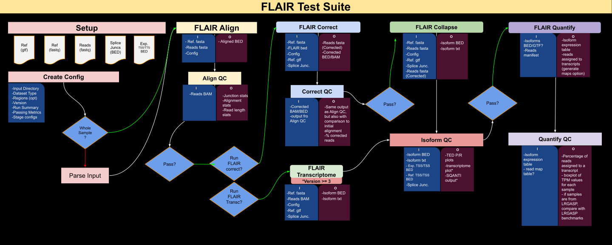

# FLAIR Test Suite Overview

This FLAIR test suite provides the means for running and benchmarking different versions of [FLAIR](https://github.com/BrooksLabUCSC/flair) **Ver. ≥ 2.0** long-read transcriptome analysis pipeline—including alignment, correction, collapse, transcriptome, and quantification. It is designed to support reproducible evaluation of transcript modeling methods across a variety of organisms, sequencing protocols, and parameter configurations.

## Contents

1. [Glossary](#glossary)
2. [Workflow](#workflow)
3. [Dataset types](#dataset-types)
4. [Dataset Attributes](#dataset-attributes)
5. [Pipeline Stages & QC](#pipeline-stages--qc)
6. [Output Layout](#output-layout)

---

## Glossary

| Term         | Definition                                                                                                                                                                                                                      |
| ------------ | -------------------------------------------------------------------------------------------------------------------------------------------------------------------------------------------------------------------------------- |
| `test_case`  | A documented config file that contains reasoning and the blueprint for a complete FLAIR workflow from raw reads through FLAIR quantify with self-contained stage options at each step.                                         |
| `run`        | An end-to-end execution of a `test_case` (identified by `test_set_id`).                                                                                                                                                          |
| `stage`      | One FLAIR sub-command (`align`, `correct`, `regionalize`, `collapse`, `transcriptome`).                                                                                                                                                |
| `flags`      | CLI options under `[run.stages.flags]`.                                                                                                                                                                                          |
| `signature`  | The name of the directory under `<stage>` (e.g. `align/abcd1234`), based on the signature string <code>`tool_version \| flags \| input_hashes`</code>. Helps determine if a stage has already been completed and can be skipped. |


---


## Workflow

The FLAIR Test Suite is organized around **end-to-end test cases** After each stage of a test-case, a set of **QC Checkpoints** validate the intermediate outputs.



---

## Dataset Types

Test cases are defined by the nature of the dataset. Long-read data acceptable for the test-suite include : 

- **Simulated Data Tests**  
  Use artificial datasets where the “true” isoforms are known in advance (e.g., simulated reads from a known transcript set, or spike-in controls). These help validate correctness without biological ambiguity.

- **Real Experimental Data Tests**  
  Use real sequencing datasets (e.g., human nanopore cDNA, direct RNA, PacBio Iso-Seq). While ground truth is not fully known, these tests come with expected biological behaviors (e.g., known mutation effects or tissue-specific splicing patterns).

  - **Platform/Library Variants**  
    Group cases by sequencing platform or library prep (e.g., Oxford Nanopore vs PacBio; cDNA vs direct RNA). Also test different read lengths or depths (e.g., high-depth vs low-depth) to ensure FLAIR performs robustly.


This grouping ensures that any changes affecting a specific data type (e.g., poly(A) tail handling) can be checked in isolation, and helps identify data-specific issues.

### Region/Scope

Test cases are also defined by region. A region is a genomic coordinate where we expect FLAIR to analyze transcripts. Test cases choose one of these region scopes:

- **Targeted Region Tests**  
  Run on a limited locus or small gene set (e.g., reads mapping to chr21 or a single gene). Cover challenging regions (e.g., high gene density, pseudogenes, repetitive sequences). Helps ensure corner cases are regularly checked and helps select quick tests for fast feedback.  
**⚠️ Note:** **To implement a targeted region test** use a template that includes the `regionalize` stage. 

- **Whole-Transcriptome Tests**  
  Run on genome-wide data (e.g., whole human transcriptome) to ensure the pipeline scales to full dataset sizes and complexities.

### FLAIR Version

Test cases are further defined by the **FLAIR version** that is ran.

| FLAIR tag | Supported stages                               |
| --------- | ---------------------------------------------- |
| **2.x**   | align, correct, collapse                       |
| **3.x**   | align, correct, regionalize, collapse, transcriptome |


---

## *Dataset* attributes

The test suite expects the user to have, at bare minimum : 

| Field                 | Description                                                      |
| --------------------- | ---------------------------------------------------------------- |
| `Long read RNA` | in fasta format 
| `FLAIR conda env`                | Downloaded conda version(s) of FLAIR they will use                                             |
| `Reference Genome`            | A reference genome fasta to align their long-reads to                             |

⚠️ However, it is heavily recommended to also include the following input files for improved isoform classification and QC :

| Field                 | Description                                                      |
| --------------------- | ---------------------------------------------------------------- |
| `reference gtf file`                | GTF annotation file                                              |
| `splice junctions`            | short-read derived junction tab-file                             |
| `TSS evidence`            | short-read derived putative transcription start sites (eg CAGE)                                   |
| `TES evidence`            | short-read derived putative transcription end sites (eg QuantSeq)                                                      |
| `ground truth`          | (TBD)  , strictly for simulated data                                      |

---


## Pipeline Stages & QC

| Stage           | Primary output(s)     | QC metrics / plots                                          |
| --------------- | --------------------- | ----------------------------------------------------------- |
| `align`         | BAM + BED             | MAPQ, read identity/length, unique junctions, splice motifs |
| `correct`       | corrected BED         | reads removed %, unique junctions, splice-motifs            |
| `regionalize`         | region BAM/BED/FA/GTF | feature counts from GTF (e.g., number of genes)             |
| `collapse`      | isoforms BED/GTF      | TED metrics, SQANTI classification                         |
| `transcriptome` | isoforms BED/GTF      | TED metrics, SQANTI classification                         |

PNG plots and TSV metrics are saved next to each stage’s outputs.

---

## Output Layout

Each stage saves output under `outputs/<test_set_id>/<stage>/<signature>/`.

### Example of Output Tree

```plaintext
outputs/
└── <test_set_id>/
    ├── run_summary.log
    ├── align/<sig>/
    ├── correct/<sig>/
    ├── regionalize/<sig>/
    ├── collapse/<sig>/
    └── transcriptome/<sig>/
```

